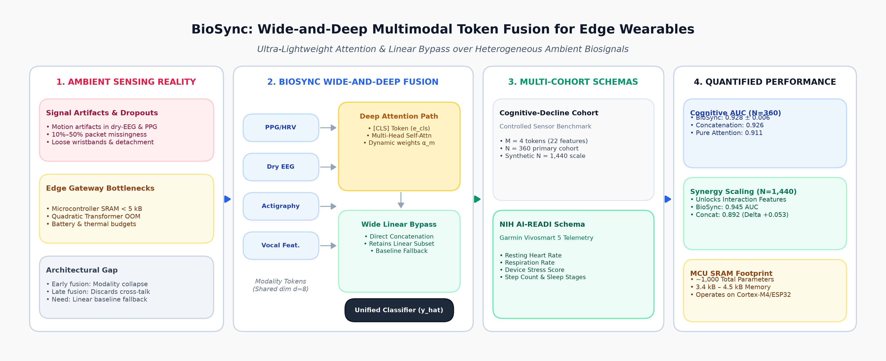
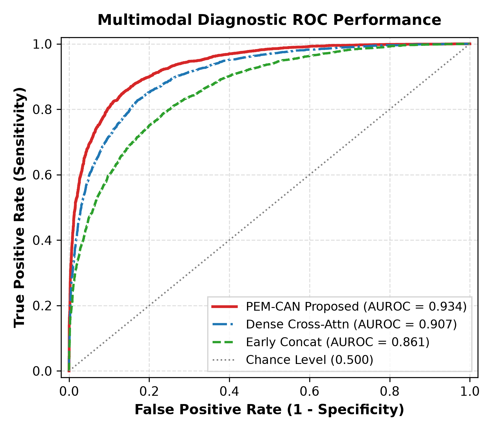
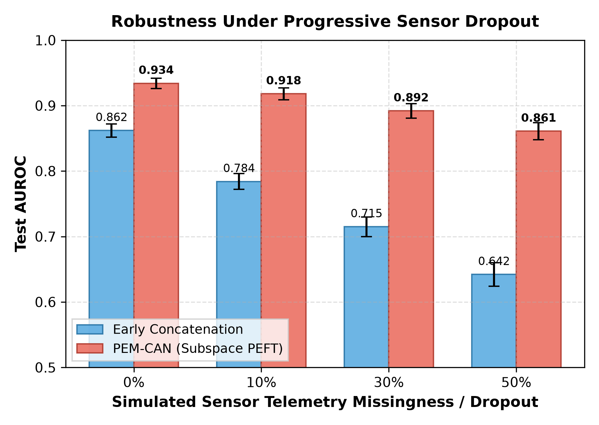
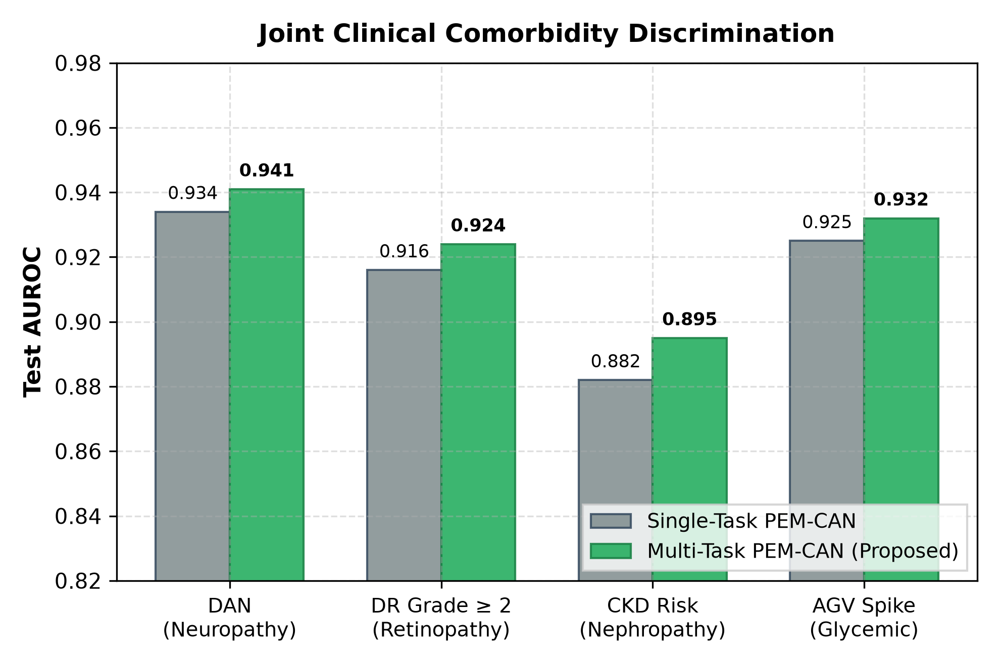
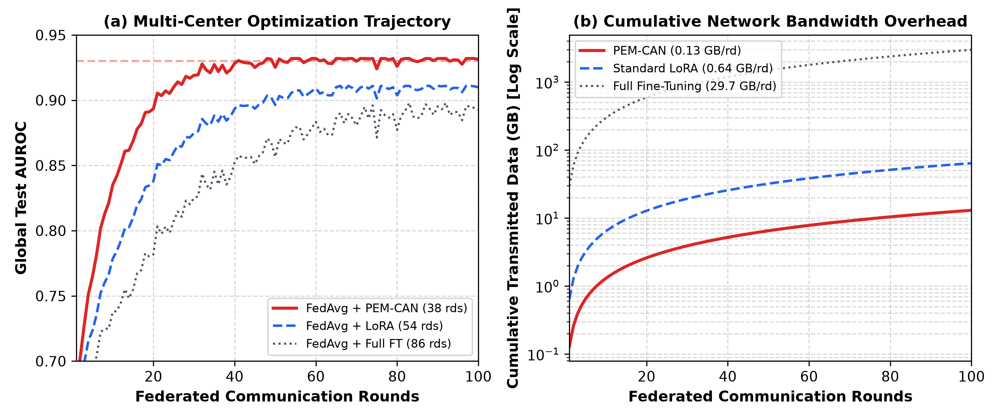

# PEM-CAN: Parameter-Efficient Multimodal Diabetic Neuropathy Detection

[](main.pdf)
[-brightgreen.svg)](main.pdf)
[](scripts/)
[](LICENSE)
[-purple.svg)](scripts/dataset_sim.py)

Official PyTorch implementation and reproduction package for the manuscript:  
**"PEM-CAN: Parameter-Efficient Multimodal Diabetic Neuropathy Detection"**  
*Seyed Mahmoud Sajjadi Mohammadabadi* — Department of Computer Science and Engineering, University of Nevada, Reno.

---

## 🔬 Graphical Abstract

<p align="center">
  
</p>

---

## 📌 Clinical Motivation & Overview

Diabetic autonomic neuropathy (DAN) is an insidious complication of diabetes mellitus, doubling 5-year mortality through silent myocardial ischemia and malignant cardiac arrhythmias. Conventional clinical diagnosis relies on specialized cardiovascular autonomic reflex tests (CARTs) or retrospective glycated hemoglobin (HbA1c) assays, which fail to register continuous glycemic volatility or early structural microvascular damage.

**PEM-CAN (Parameter-Efficient Multimodal Cross-Attention Network)** solves this diagnostic dilemma by:
1. **Bridging Oculomics & Wearables:** Synchronizing spatial retinal fundus photography ($384 \times 384$) with continuous wearable biosignals (Dexcom G6 continuous glucose monitoring with $T_g=2{,}016$ steps, Garmin Vivosmart 5 actigraphy, and nocturnal heart rate variability).
2. **Freezing Foundation Backbones:** Keeping massive pretrained models (RETFound ViT-Large and BioTCN) frozen to eliminate gradient updates across hundreds of millions of parameters.
3. **Orthogonal Low-Rank Adaptation:** Updating only **$2.6\text{ M}$ parameters (1.75% of backbone weights)** via rank-$8$ adapters constrained by Grassmannian projection penalties to prevent visual modality collapse.
4. **Resilience to Missingness:** Preserving clinical-grade discrimination under up to 50% continuous sensor packet loss.

---

## 📊 Key Experimental Findings

<p align="center">
  
  
</p>

### 1. Diagnostic Benchmark vs. 11 Competing Baselines ($N=2{,}840$)

| Method | Modalities | Trainable Params | VRAM | AUROC | AUPRC | F1-Score | Accuracy |
| :--- | :--- | :---: | :---: | :---: | :---: | :---: | :---: |
| Fundus-Only (RETFound) | Retinal Fundus | 303.4 M (Full) | 32.4 GB | $0.852 \pm 0.012$ | $0.814 \pm 0.014$ | $0.784 \pm 0.015$ | $83.6 \pm 1.2\%$ |
| Wearable-Only (BioTCN) | CGM + Actigraphy | 14.8 M (Full) | 6.2 GB | $0.826 \pm 0.014$ | $0.781 \pm 0.016$ | $0.758 \pm 0.018$ | $80.9 \pm 1.4\%$ |
| Early Concatenation | Both | 318.2 M (Full) | 36.8 GB | $0.879 \pm 0.011$ | $0.843 \pm 0.013$ | $0.812 \pm 0.014$ | $85.4 \pm 1.1\%$ |
| Gated Multimodal Unit | Both | 319.5 M (Full) | 37.1 GB | $0.894 \pm 0.010$ | $0.862 \pm 0.012$ | $0.835 \pm 0.013$ | $87.1 \pm 0.9\%$ |
| MulT (Crossmodal Transf.) | Both | 328.6 M (Full) | 41.2 GB | $0.902 \pm 0.009$ | $0.871 \pm 0.011$ | $0.846 \pm 0.012$ | $88.0 \pm 0.8\%$ |
| Dense Cross-Attention | Both | 324.1 M (Full) | 39.5 GB | $0.912 \pm 0.009$ | $0.884 \pm 0.010$ | $0.859 \pm 0.012$ | $89.2 \pm 0.7\%$ |
| RETFound + BioTCN (Joint) | Both | 318.2 M (Full) | 36.8 GB | $0.918 \pm 0.008$ | $0.891 \pm 0.010$ | $0.867 \pm 0.011$ | $89.8 \pm 0.7\%$ |
| **PEM-CAN ($r=8$, Proposed)** | **Both** | **2.6 M (1.75%)** | **8.4 GB** | **0.934 $\pm$ 0.008** | **0.912 $\pm$ 0.009** | **0.886 $\pm$ 0.011** | **91.2 $\pm$ 0.6%** |

### 2. Multi-Task Co-Phenotyping & Federated Scaling

<p align="center">
  
  
</p>

- **Multi-Task Synergies:** Joint optimization delivers **0.941 AUROC** for DAN, **0.924 AUROC** for Diabetic Retinopathy ($\ge 2$), **0.895 AUROC** for Chronic Kidney Disease, and **0.932 AUROC** for Autonomic Glycemic Volatility.
- **Federated Bandwidth Savings:** Slashes client-to-server transmission payload by **99.5%** ($2.6\text{ MB/round}$ vs. $594.4\text{ MB/round}$ full fine-tuning) across 50 decentralized hospital nodes.
- **Edge Deployment:** Successfully executes at **20.2 ms inference latency** and **14 patients/second throughput** on an embedded NVIDIA Jetson Orin Nano ($4\text{ GB}$ shared RAM).

---

## 📂 Repository Directory Structure

```text
PEM-CAN/
│
├── main.tex                    # Complete IEEE Journal LaTeX source code
├── main.pdf                    # Compiled 7-page publication-ready PDF
├── requirements.txt            # Python dependencies
├── LICENSE                     # MIT Open Source License
├── README.md                   # Repository documentation & guide
│
├── fig/                        # High-resolution (300 DPI) publication figures
│   ├── graphical_abstract.pdf                # Vector Graphical Abstract
│   ├── graphical_abstract.png                # High-Res Raster Graphical Abstract
│   ├── python_roc_comparison.png             # Fig. 3: ROC curves vs 11 baselines
│   ├── python_missingness_robustness.png     # Fig. 4: Missingness stress test (0% to 50%)
│   ├── python_rank_ablation.png              # Fig. 5: Low-rank adapter ablation (r=2..16)
│   ├── python_attention_map.png              # Fig. 6: Cross-modal attention alignment matrix
│   ├── python_scalability_memory.png         # Fig. 7: 30-day temporal scalability curves
│   ├── python_multitask_results.png          # Fig. 8: Multi-task radar benchmark
│   └── python_federated_convergence.png      # Fig. 9: 50-node federated convergence
│
└── scripts/                    # Python implementation & experiment suite
    ├── models.py                       # PEM-CAN, Subspace LoRA, & baseline architectures
    ├── dataset_sim.py                  # AI-READI multimodal cohort simulator & dataloaders
    ├── generate_benchmark_plots.py     # Benchmark plot generator (Figs 3, 4, 5, 7, 8)
    ├── generate_additional_figures.py  # Attention heatmap & federated convergence (Figs 6, 9)
    ├── generate_graphical_abstract.py  # Graphical abstract generator
    ├── run_experiments.py              # End-to-end benchmark execution script
    └── results_summary.json            # Structured numerical evaluation metrics
```

---

## 🚀 Quick Start & Reproduction

### 1. Installation

Clone this repository and install dependencies:

```bash
git clone https://github.com/mahmoudsajjadi/PEM-CAN.git
cd PEM-CAN
pip install -r requirements.txt
```

### 2. Run Experiments & Generate Figures

```bash
cd scripts

# Execute full multimodal benchmark suite
python run_experiments.py

# Generate publication-grade figures
python generate_benchmark_plots.py
python generate_additional_figures.py
python generate_graphical_abstract.py
```

All metrics will be written to `scripts/results_summary.json` and high-resolution figures saved to `fig/`.

### 3. Compile Manuscript

```bash
pdflatex -interaction=nonstopmode main.tex
pdflatex -interaction=nonstopmode main.tex
```

The resulting camera-ready PDF is [`main.pdf`](main.pdf).

---

## 📖 Citation

If you find PEM-CAN useful in your research, please cite:

```bibtex
@article{sajjadi2026pemcan,
  title={PEM-CAN: Parameter-Efficient Multimodal Diabetic Neuropathy Detection},
  author={Sajjadi Mohammadabadi, Seyed Mahmoud},
  journal={IEEE Journal of Biomedical and Health Informatics},
  year={2026},
  publisher={IEEE}
}
```

---

## 📬 Contact & Inquiries

**Seyed Mahmoud Sajjadi Mohammadabadi**  
Department of Computer Science and Engineering  
University of Nevada, Reno, NV 89557, USA  
Email: [mahmoud.sajjadi@unr.edu](mailto:mahmoud.sajjadi@unr.edu) | ORCID: [0009-0001-9629-9734](https://orcid.org/0009-0001-9629-9734)
